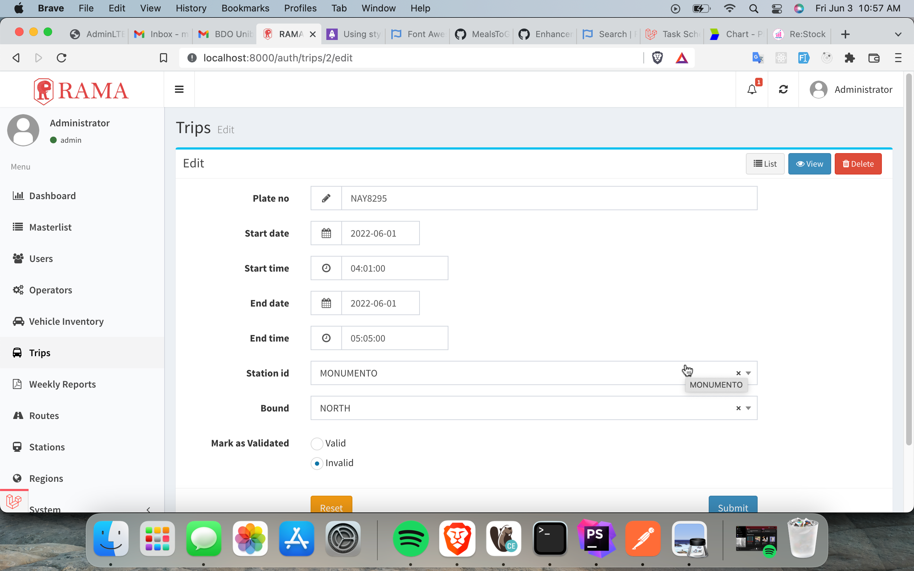

### Description:

- These enhancements allow users to generate reports on trips.
- (optional) REST API for loginViaCredentials, loginViaQr, and scanQr
- (optional) Adds dashboard

### New Dependencies:

`"barryvdh/laravel-snappy": "^1.0"`

> Required to generate PDF reports

`"php-open-source-saver/jwt-auth": "^1.4"`

> Required to use API login

Run to install: `composer require barryvdh/laravel-snappy php-open-source-saver/jwt-auth`

### New files

| Directory/File | Description |
|--------------|-------------|
| __New__ | |
| [app\Admin\Actions\Trip\Invalidate.php](/app/Admin/Actions/Trip/Invalidate.php) | Add a dropdown button to invalidate trip in Trips grid |
| [app\Admin\Actions\Trip\Validate.php](/app/Admin/Actions/Trip/Validate.php) | Add a dropdown button to validate trip in Trips grid  |
| [app\Admin\Controllers\OperatorController.php](/app/Admin/Controllers/OperatorController.php) | Admin controller for operators |
| [app\Admin\Controllers\TripController.php](/app/Admin/Controllers/TripController.php) | Admin controller for trips |
| [app\Admin\Controllers\WeeklyReportBatchController.php](/app/Admin/Controllers/WeeklyReportBatchController.php) | Admin controller for weekly report batches |
| [app\Admin\Controllers\WeeklyReportController.php](/app/Admin/Controllers/WeeklyReportController.php) | Admin controller for weekly reports. _Note: accessible only within weekly report batch_ |
| [app\Console\Commands\SyncTripsCommand.php](/app/Console/Commands/SyncTripsCommand.php) | Command to sync trips table to puv_details table |
| [app\Http\Controllers\Api\AuthController.php](/app/Http/Controllers/Api/AuthController.php) | New loginViaCredentials and loginViaQr methods |
| [app\Http\Controllers\Api\ScanQRController.php](/app/Http/Controllers/Api/ScanQRController.php) | New invoke method for scanning QR |
| [app\Jobs\GenerateWeeklyReportJob.php](/app/Jobs/GenerateWeeklyReportJob.php) | Job to generate weekly report. _Note: This is queued._ |
| [app\Models\Mode.php](/app/Models/Mode.php) | Model for modes/vehicle types |
| [app\Models\Notification.php](/app/Models/Notification.php) | Model that extends DatabaseNotification to facilitate marking notifications as read |
| [app\Models\Operator.php](/app/Models/Operator.php) | Model for operators including relationships |
| [app\Models\PuvAttendance.php](/app/Models/PuvAttendance.php) | Model for puv_attendance table for creation and retrieval |
| [app\Models\PuvDetail.php](/app/Models/PuvDetail.php) | Model for puv_details table for creation and retrieval |
| [app\Models\Region.php](/app/Models/Region.php) | Model for regions table to generate report |
| [app\Models\Trip.php](/app/Models/Trip.php) | Model for trips table |
| [app\Models\Vehicle.php](/app/Models/Vehicle.php) | Model that extends VehicleInventory for relationships |
| [app\Models\WeeklyReportBatch.php](/app/Models/WeeklyReportBatch.php) | Model for weekly report batches |
| [app\Models\WeeklyReport.php](/app/Models/WeeklyReport.php) | Model for weekly reports |
| [app\Notifications\WeeklyReportGeneratedNotification.php](/app/Notifications/WeeklyReportGeneratedNotification.php) | Notification for when weekly report has been generated |
| [app\Services\GenerateTripsService.php](/app/Services/GenerateTripsService.php) | Service for generating trips, used by SyncTripsCommand |
| [app\Services\GenerateWeeklyReportService.php](/app/Services/GenerateWeeklyReportService.php) | Service for generating weekly report |
| [app\Dashboard.php](/app/Dashboard.php) | Defines custom dashboard for HomeController |
| [app\helpers.php](/app/helpers.php) | Defines new global functions |
| [resources\views\dashboard\chart.blade.php](/resources/views/dashboard/chart.blade.php) |  Custom chart for dashboard |
| [resources\views\navbar\notifications.blade.php](/resources/views/navbar/notifications.blade.php) | View for notifications icon in navbar including dropdown |
| [resources\views\card.blade.php](/resources/views/card.blade.php) | Custom card for use in dashboard |
| [resources\views\report.blade.php](/resources/views/report.blade.php) | Report template for PDF generation |
| __Updated__ | |
| [app\Admin\Controllers\HomeController.php](/app/Admin/Controllers/HomeController.php) | Updated Dashboard referenced |
| [app\Admin\bootstrap.php](/app/Admin/bootstrap.php) | Added notification icon in Navbar |
| [app\Admin\routes.php](/app/Admin/routes.php) | Added routes for new controllers _(see above)_|
| [app\Console\Kernel.php](/app/Console/Kernel.php) | Added scheduled command for syncing trips |
| [app\Models\User.php](/app/Models/User.php) | Added JWT features |
| [routes\api.php](/routes/api.php) | Added new routes for API controllers |
| [routes\web.php](/routes/web.php) | Added route for marking notifications as read |

### New tables and attributes

| Table              | Attributes                                                                                 |Description                                     | 
|--------------|----------------------------------------------------------|---------------------------------|
| modes           | id, name, description                                                              | Reference table for vehicle type |
| operators      | id, region_id, name, contact_number, email, full_address | Table for operators                       |
| weekly_report_batches | id, week_no, start_date, end_date, user_id       | Table for weekly report batches |
| weekly_reports | id, weekly_report_batch_id, operator_id, filepath           | Table for weekly reports              |
| trips               | id, plate_no, start_date, start_time, end_date, end_time, station_id, bound, is_validated, user_id | Table for trips |
| notifications | id, type, notifiable, data, read_at                                            | Default laravel notifications table |
| operator_route | operator_id, route_code                                                      | Table for operator - route combination |

### Seeders

- [OperatorSeeder](/database/seeders/OperatorSeeder.php)

> Populates the operators table by taking the distinct names from the vehicle inventory table

- [OperatorRouteSeeder](/database/seeders/OperatorRouteSeeder.php)

> Populates the operator_route table based on vehicle inventory table

### Screenshots

