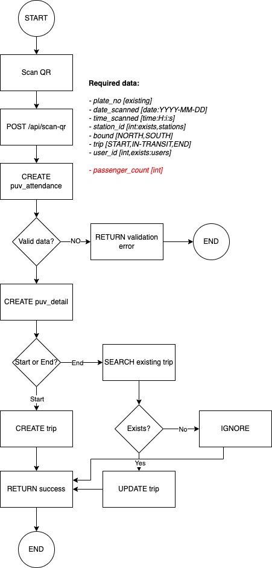

## Enhancements

### 2022-06-09

- Converts scan qr logic from plain php to controller
- Creates TRIP entry for every masterlist write
- Tests for Scan QR

### Workflow



### Instructions

1. Copy `ScanQRController` to `App\Http\Controllers\Api` folder
2. Update `trips` table:

| Field            | Type | Mode   |
|------------------|------|--------|
| start_station_id | int  | Create |
| end_station_id   | int  | Create |
| route_code       |      | Delete |

See `scan.sql`

3. Add the following to `routes\api.php`:

```php
Route::post('/scan-qr', \App\Http\Controllers\Api\ScanQRController::class)
   ->name('api.scan-qr');
```

### Reminders

The data fields from the frontend must be updated
to match the data requirements.

*Note: The __passenger_count__ will be added only once the
proposal to integrated Ridemap is approved.*  
